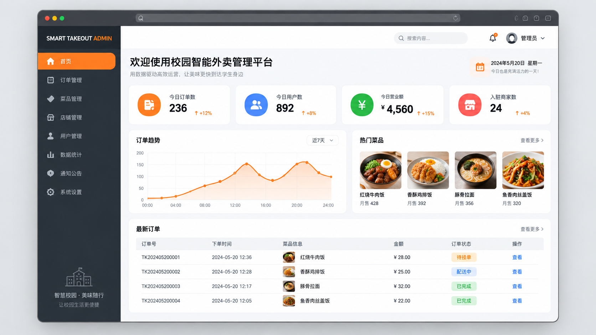
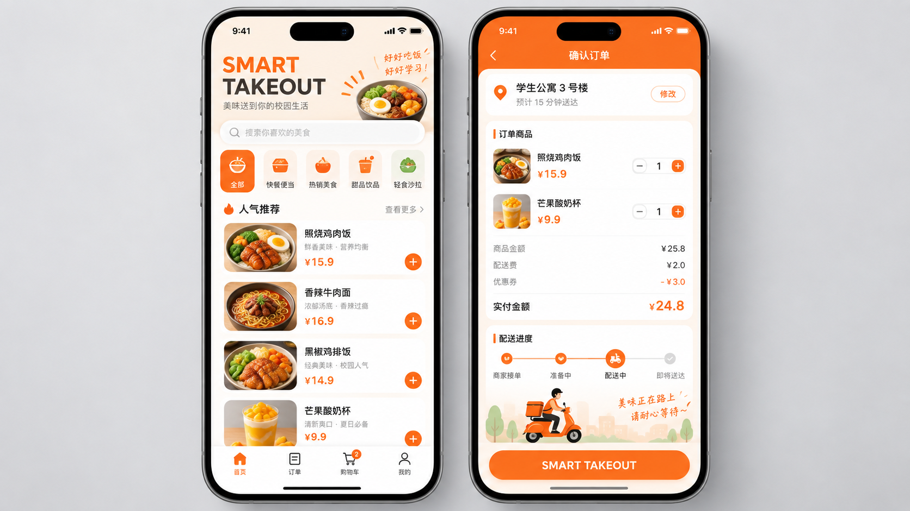

# Smart Takeout Platform

> A full-stack campus dining and takeout platform built with Spring Boot. It supports customer ordering and an administrator workspace, with Redis caching, RabbitMQ asynchronous order processing, flash-sale ordering, coupons, and real-time order notifications.

## Highlights

- **Core dining workflow** — user login, shopping cart, address book, menu and set-meal browsing, order creation, payment callbacks, order lifecycle management, and merchant-side operations.
- **Redis for menu reads** — shared cache-aside for dish and set-meal categories, startup warm-up, short-lived empty results, jittered expiration, renewable Redis mutexes with ownership-checked Lua publication/unlock, and per-instance cache statistics. See [cache implementation and validation](docs/menu-cache.md).
- **High-concurrency flash sales** — a Lua script atomically validates stock and one-user-one-order constraints; database conditional updates and unique guards provide the durable stock boundary.
- **Reliable order processing** — delayed queues cancel unpaid orders after the timeout window; dead-letter handling and retry records improve recoverability.
- **Marketing and observability** — coupon claiming/usage, Flyway database migrations, WebSocket order notifications, and administrative reporting.

## Interface Preview

> The images below are illustrative interface previews created for this repository. They show the intended product experience and do not contain production or personal data.

<table>
  <tr>
    <td width="50%" align="center"><strong>Administration Dashboard</strong></td>
    <td width="50%" align="center"><strong>Mini Program Ordering</strong></td>
  </tr>
  <tr>
    <td></td>
    <td></td>
  </tr>
</table>

## Architecture

```text
sky-take-out-jjs
├── gateway-service  # Public HTTP and WebSocket entry point, port 8080
├── account-service  # Users, employees, permissions, addresses, port 8082
├── catalog-service  # Categories, dishes, set meals, images and menu cache, port 8083
├── trade-service    # Cart, orders, inventory, marketing and payment, port 8081
├── notification-service # RabbitMQ events and WebSocket delivery, port 8084
├── sky-contracts    # Feign DTOs and business event contracts
├── sky-common       # Shared infrastructure utilities
└── sky-pojo         # Existing business models used within the services
```

## Tech Stack

| Area | Technologies |
| --- | --- |
| Backend | Java 17, Spring Boot 3.5, Spring Cloud 2025.0, Spring Cloud Alibaba 2025.0, Gateway, OpenFeign, Nacos |
| Persistence | MySQL, MyBatis-Plus, Druid, Flyway |
| Middleware | Redis, RabbitMQ |
| Security & API | JWT, Knife4j / Swagger |
| Integrations | WeChat Pay, Alibaba Cloud OSS, WebSocket |

## Getting Started

### Prerequisites

- JDK 17+
- Maven 3.9+
- MySQL 8+
- Redis 6+
- RabbitMQ 3+
- Nacos 2.5+ or a compatible 3.x release

### 1. Configure local services

Copy the example configuration and supply local credentials:

```bash
cp trade-service/src/main/resources/application-dev.example.yml trade-service/src/main/resources/application-dev.yml
```

`application-dev.yml` is deliberately ignored by Git. Do not commit credentials, certificates, or private keys.

Create the trade database matching `sky.datasource.database`. Copy account tables with `tools/MigrateAccountData.java`, then copy catalog tables into `sky_take_out_catalog` with `tools/MigrateCatalogData.java`. Stop writes during each cutover and set `SKY_DB_PASSWORD` for services that read credentials from environment variables.

### 2. Run the application

```bash
mvn clean package
java -jar account-service/target/account-service-1.0-SNAPSHOT.jar
java -jar catalog-service/target/catalog-service-1.0-SNAPSHOT.jar
java -jar trade-service/target/trade-service-1.0-SNAPSHOT.jar
java -jar notification-service/target/notification-service-1.0-SNAPSHOT.jar
java -jar gateway-service/target/gateway-service-1.0-SNAPSHOT.jar
```

Start MySQL, Redis, RabbitMQ, and Nacos first. The gateway serves the existing public paths on `http://localhost:8080`. Set the same `SKY_INTERNAL_TOKEN` and JWT secret variables on account, catalog and trade services. See [local startup and regression guide](docs/微服务本地启动与回归.md) for details.

## Key Design Notes

| Scenario | Implementation |
| --- | --- |
| Menu reads | Cache-aside with expiration, warm-up, and mutex protection for cache rebuilds |
| Flash-sale set meals | Redis + Lua atomically checks inventory and duplicate orders; database conditional updates and unique guards persist the order without overselling |
| Normal order submission | The API accepts an idempotent command and publishes it to RabbitMQ after commit; the consumer performs pricing, inventory deduction and order persistence |
| Unpaid orders | RabbitMQ TTL and dead-letter queues trigger timeout cancellation and rollback processing |
| Coupon claims | Database conditional updates prevent issuing more coupons than available stock |
| Order notifications | Trade Outbox publishes RabbitMQ events; Redis Pub/Sub fans them out to WebSocket sessions on notification instances |

## Repository Hygiene

This repository intentionally excludes local IDE settings, build output, runtime files, private job-search materials, environment configuration, and certificates. Use `application-dev.example.yml` as the starting point for local configuration.

## License

This project is provided for learning and portfolio demonstration. Ensure that any third-party service credentials, assets, or dependencies you use comply with their respective licenses and terms.
