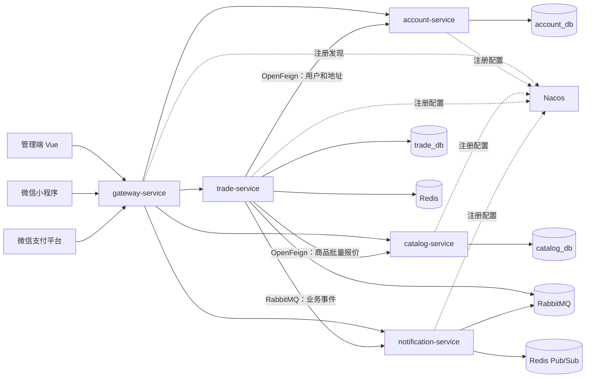

# 智餐外卖微服务架构改造设计方案

> 版本：V2.0  
> 更新日期：2026-09-19  
> 后端工程：`sky-take-out-jjs`  
> 目标形态：5 个可独立运行的服务  
> 当前进度：已完成网关、账户、交易聚合服务，共 3 个服务；商品服务和通知服务待拆分

## 1. 改造目标

在保持管理端、小程序、支付回调、图片地址、WebSocket 地址以及主要请求响应结构不变的前提下，将后端建设为以下 5 个服务：

1. `gateway-service`：统一对外入口。
2. `account-service`：用户、员工、权限和收货地址。
3. `catalog-service`：分类、菜品、口味、套餐及商品展示信息。
4. `trade-service`：购物车、订单、库存、优惠券、红包、秒杀和支付。
5. `notification-service`：WebSocket、催单、支付结果及后续消息通知。

技术栈使用 Java 17、Spring Boot 3.5、Spring Cloud、Spring Cloud Alibaba、Nacos、OpenFeign、Spring Cloud Gateway、MyBatis-Plus、MySQL、Redis、RabbitMQ 和 Flyway。

“功能不变”指对外行为和业务规则保持兼容。服务拆分后，本地方法调用会变成网络调用，部分数据会跨库，因此必须重新明确数据所有权、失败处理和一致性规则，不能只移动 Controller。

## 2. 核心拆分判断

### 2.1 账户服务独立

账户服务的数据边界清晰，适合独立：

- 微信用户和用户资料
- 员工登录与员工资料
- 角色、权限及员工授权关系
- 用户收货地址

交易服务主要通过查询使用这些数据，例如下单查询地址、支付查询用户 OpenID、管理接口判断员工权限。账户服务是账户表的唯一写入方，其他服务通过 OpenFeign 调用内部接口。

### 2.2 商品服务独立

商品服务以查询为主，适合独立扩容，拆分难度相对可控：

- 分类
- 菜品
- 菜品口味
- 套餐
- 套餐菜品关系
- 商品图片、价格和上下架状态

商品服务负责商品资料，交易服务负责成交和库存。订单必须保存商品名称、价格、图片等成交快照，不能依赖商品服务中的实时数据还原历史订单。

### 2.3 强交易能力继续集中

订单、库存、购物车、优惠券、红包、秒杀和支付继续放在 `trade-service`，避免在本轮引入复杂的分布式事务。

一次下单通常包含库存扣减、优惠权益占用、订单创建、明细创建、购物车清理和超时任务记录。上述写操作继续在交易数据库的本地事务中完成。商品报价可在事务开始前查询，账户地址也应在持有数据库锁之前查询并形成快照。

### 2.4 通知服务独立

通知与核心交易事务耦合较低，适合通过 RabbitMQ 解耦：

- 管理端 WebSocket 订单通知
- 用户催单通知
- 支付成功通知
- 订单状态变化通知
- 后续短信、微信订阅消息和站内消息扩展

交易服务完成业务事务后发布可靠事件，通知服务消费事件并推送。通知失败不能回滚已完成的支付或订单事务。

### 2.5 网关统一入口

`gateway-service` 负责：

- 保持原 `/admin/**`、`/user/**`、`/notify/**`、`/ws/**` 等公开路径
- Nacos 服务发现与负载均衡
- Redis 令牌桶限流
- `X-Trace-Id` 生成与透传
- HTTP 和 WebSocket 路由
- 跨域及统一入口治理

网关不直接访问业务数据库，也不处理订单、支付或库存事务。

## 3. 当前状态与目标状态

### 3.1 当前已经完成的 3 个服务

| 当前服务 | 代码模块 | 当前职责 | 状态 |
| --- | --- | --- | --- |
| `gateway-service` | `gateway-service` | 网关、路由、限流、追踪、WebSocket 转发 | 已完成 |
| `account-service` | `account-service` | 用户、员工、权限、地址 | 已完成 |
| `commerce-service` | `sky-server` | 商品、交易、支付、营销、报表、通知 | 已完成第一阶段拆分，后续继续拆解 |

`sky-common` 和 `sky-pojo` 是 Maven 依赖模块，不是可独立运行的微服务。

### 3.2 最终目标的 5 个服务

| 目标服务 | 来源 | 目标状态 |
| --- | --- | --- |
| `gateway-service` | 保留当前网关 | 保持独立 |
| `account-service` | 保留当前账户服务 | 保持独立 |
| `catalog-service` | 从当前 `commerce-service` 拆出商品相关代码 | 新增 |
| `trade-service` | 当前 `commerce-service` 移出商品与通知后形成 | 重命名并收敛职责 |
| `notification-service` | 从当前 `commerce-service` 拆出 WebSocket 和通知代码 | 新增 |

推荐顺序：先拆 `catalog-service`，再拆 `notification-service`，最后将 `commerce-service` 的服务名和工程模块名调整为 `trade-service`。迁移期间不应提前改名，以免代码移动、注册名变化和数据切换同时发生。

## 4. 总体架构



## 5. 服务职责与边界

### 5.1 `gateway-service`

**负责：**

- 公开路径路由
- 服务发现和负载均衡
- HTTP/WebSocket 转发
- 限流、跨域、追踪 ID
- 统一入口健康检查和指标

**不负责：**

- 业务表查询
- 订单状态变更
- JWT 对应的业务权限数据维护
- 支付验签和退款

### 5.2 `account-service`

**负责：**

- 用户微信登录
- 员工登录及员工管理
- 角色和权限判断
- 收货地址增删改查
- 对内部服务提供用户、地址和权限查询

**主要表：**

- `user`
- `employee`
- `address_book`
- `role`
- `permission`
- `employee_role`
- `role_permission`

### 5.3 `catalog-service`

**负责：**

- 分类管理与查询
- 菜品管理、口味和上下架
- 套餐管理、套餐菜品关系和上下架
- 商品详情、商品图片和批量报价查询
- 商品缓存的创建、失效和预热

**主要表：**

- `category`
- `dish`
- `dish_flavor`
- `setmeal`
- `setmeal_dish`

商品服务只维护商品主数据。可销售库存不放在商品服务中，避免订单创建时跨服务扣库存。

### 5.4 `trade-service`

**负责：**

- 店铺营业状态的交易校验
- 购物车
- 订单和订单明细
- 交易库存账本
- 优惠券、红包和秒杀
- 微信支付下单、回调和退款
- 超时取消、失败重试和可靠性任务
- 经营报表中与订单有关的部分
- 业务事件 Outbox 和 RabbitMQ 发布

**主要表：**

- `shopping_cart`
- `orders`
- `order_detail`
- 交易库存相关表
- `coupon`、`user_coupon`
- 红包及红包购买单相关表
- 秒杀活动、预约和一人一单约束表
- 支付流水、订单幂等、可靠性任务、MQ 失败记录

### 5.5 `notification-service`

**负责：**

- `/ws/**` WebSocket 连接
- 消费订单、支付、催单等 RabbitMQ 事件
- 向持有连接的实例推送消息
- 多实例间通过 Redis Pub/Sub 广播
- 通知投递记录、失败次数及必要的人工重放

通知服务不能修改订单状态。它只消费交易结果并负责送达，重复事件通过 `eventId` 或业务唯一键去重。

## 6. 数据归属

| 数据 | 唯一写入服务 | 其他服务的使用方式 |
| --- | --- | --- |
| 用户、员工、权限、地址 | `account-service` | OpenFeign 查询必要字段 |
| 分类、菜品、口味、套餐、商品资料 | `catalog-service` | OpenFeign 批量查询或事件同步只读快照 |
| 购物车、订单、订单明细 | `trade-service` | 对外 API 或事件 |
| 库存、优惠券、红包、秒杀 | `trade-service` | 交易本地事务 |
| 支付流水、退款、可靠性任务 | `trade-service` | 交易内部使用 |
| WebSocket 会话和通知投递记录 | `notification-service` | RabbitMQ 事件驱动 |

每张业务表只能有一个服务写入。禁止为了减少改造量，让交易服务继续直连商品库或账户库。服务间共享的是契约 DTO、事件和必要快照，不是 Mapper 和数据库实体。

## 7. 商品服务拆分设计

### 7.1 内部接口

交易服务需要的商品内部接口至少包括：

| 用途 | 输入 | 返回 |
| --- | --- | --- |
| 批量查询商品报价 | 菜品/套餐 ID 列表 | ID、名称、当前价格、状态、版本 |
| 查询套餐组成 | 套餐 ID | 套餐商品明细和数量 |
| 查询商品详情快照 | 商品 ID、类型 | 名称、图片、规格及价格 |

接口必须支持批量查询，避免一个购物车产生大量 Feign 请求。查询设置短超时，只有幂等 GET 请求可以有限重试。

### 7.2 下单流程

目标流程：

1. 交易服务读取购物车。
2. 调用商品服务批量查询当前报价、状态和版本。
3. 校验商品可售状态及客户端金额。
4. 形成订单商品快照。
5. 开启交易数据库本地事务。
6. 扣减交易库存、占用优惠权益、创建订单和明细。
7. 提交 Outbox 事件。

商品查询不能在持有库存数据库锁时进行。商品服务不可用时，不使用过期或未经确认的数据继续创建新订单；应返回可重试失败。

### 7.3 库存所有权

为了保留订单和库存的一致性，库存必须由 `trade-service` 持有。拆商品服务前应建立明确的交易库存表或库存账本，由商品上架、补货等事件同步初始化，但实际扣减只能发生在交易数据库事务内。

若继续把库存字段放在商品库并由商品服务扣减，一次下单就会形成跨库事务，需要 Saga、补偿、对账和库存预占状态。本方案不采用该路线。

### 7.4 缓存处理

- 菜单和商品详情缓存由商品服务维护。
- 商品修改后由商品服务清理自己的缓存。
- 交易服务只缓存短期商品快照或报价，不维护商品主缓存。
- 缓存键包含环境、服务名和业务版本，避免服务间键冲突。

## 8. 交易服务一致性设计

### 8.1 普通订单

- 使用 `requestId` 和数据库唯一约束保证重复提交幂等。
- 库存、优惠权益、订单、明细和可靠性任务在同一个交易数据库事务内提交。
- 地址及商品资料保存成交快照，后续账户或商品修改不改变历史订单。

### 8.2 秒杀

- Redis/Lua 负责高并发预扣资格。
- 数据库库存与一人一单唯一约束作为最终裁决。
- MQ 重复投递不能生成重复订单。
- 失败后按明确状态回补 Redis 资格和数据库库存。

### 8.3 支付与退款

- `/notify/paySuccess` 继续由交易服务处理。
- 交易服务完成微信签名、金额、交易号及业务单类型校验。
- 重复回调返回稳定结果，不重复修改订单。
- 退款任务以支付流水和订单状态为依据，失败进入可靠性任务和人工核对流程。

### 8.4 可靠事件

交易事务中同时写入 Outbox：

```text
订单/支付状态修改 + outbox_event 写入 = 同一本地事务
```

发布器将事件发送到 RabbitMQ，确认成功后标记已发送。通知服务按至少一次投递设计，必须实现消费幂等。

建议事件公共字段：

- `eventId`
- `eventType`
- `eventVersion`
- `occurredAt`
- `traceId`
- `aggregateId`
- `payload`

## 9. 通知服务拆分设计

### 9.1 事件类型

首批事件包括：

- `OrderSubmitted`
- `OrderPaid`
- `OrderCancelled`
- `OrderStatusChanged`
- `OrderReminderCreated`
- `RefundSucceeded`

### 9.2 RabbitMQ 拓扑

建议新增通知专用交换机和队列：

```text
sky.business.event.exchange
  └─ notification.order.queue
  └─ notification.payment.queue
```

消费者手动确认。处理成功后 ACK；可恢复失败进入有限重试；超过次数进入死信队列和失败记录。消息格式需要版本号，不能直接序列化数据库实体。

### 9.3 WebSocket 多实例

WebSocket 会话仍只能存在于建立连接的进程内。通知服务多实例时采用：

```text
RabbitMQ 业务事件
    → 某个通知消费者
    → Redis Pub/Sub 广播
    → 每个通知实例
    → 本实例持有的 WebSocket 会话
```

连接容器使用线程安全集合。处理连接关闭、异常断开、心跳、重连和同一客户端重复连接。网关使用独立 `lb:ws://notification-service` 路由。

## 10. 网关路由

公开路径保持不变，最终路由如下：

| 公开路径 | 目标服务 |
| --- | --- |
| `/admin/employee/**` | `account-service` |
| `/user/user/**`、`/user/addressBook/**` | `account-service` |
| `/admin/category/**`、`/admin/dish/**`、`/admin/setmeal/**` | `catalog-service` |
| `/user/category/**`、`/user/dish/**`、`/user/setmeal/**` | `catalog-service` |
| `/dishes/**`、`/setmeals/**` | `catalog-service` |
| `/user/shoppingCart/**`、`/user/order/**` | `trade-service` |
| `/admin/order/**`、`/admin/report/**`、`/admin/workspace/**` | `trade-service` |
| `/user/red-packet/**`、`/user/seckill/**`、`/admin/seckill/**` | `trade-service` |
| `/notify/paySuccess` | `trade-service` |
| `/ws/**` | `notification-service` |

具体路由优先于通配路由。写请求不在网关自动重试。支付回调不能套用普通用户限流规则，WebSocket 使用单独路由。

迁移期间，未拆出的路径继续指向当前 `commerce-service`。每完成一个服务并通过回归，才切换对应路径。

## 11. 服务间鉴权与追踪

- 对外继续使用管理端 `token` 和用户端 `authentication` 请求头。
- 网关清理外部伪造的内部身份头。
- 内部 Feign 请求携带服务内部令牌；生产环境应使用受保护网络和独立凭据。
- 网关生成或接续 `X-Trace-Id`，通过 Feign 和 RabbitMQ 事件继续传递。
- 不在日志中打印完整 JWT、手机号、支付私钥、OSS 密钥或数据库密码。
- 账户、商品、交易和通知内部接口不经公网开放。

## 12. 工程结构

最终建议结构：

```text
sky-take-out-jjs/
├─ pom.xml
├─ sky-common/                 # 公共工具和基础错误定义
├─ sky-pojo/                   # 迁移期间保留的旧模型模块
├─ sky-contracts/              # 内部 API DTO 和 RabbitMQ 事件契约
├─ gateway-service/
├─ account-service/
├─ catalog-service/
├─ trade-service/
├─ notification-service/
└─ docs/
```

最终是 5 个可运行服务，Maven 模块数量会多于 5。`sky-common`、`sky-contracts` 和迁移期间的 `sky-pojo` 不算微服务。

长期应逐步缩小 `sky-pojo`：数据库实体留在其所属服务，跨服务 DTO 和事件放入 `sky-contracts`，禁止所有服务依赖一个包含全部数据库实体的大公共模块。

## 13. 配置与部署

### 13.1 Nacos

- 服务名固定为 `gateway-service`、`account-service`、`catalog-service`、`trade-service`、`notification-service`。
- 开发、测试、生产使用不同 namespace。
- 数据库密码、支付私钥和 OSS 密钥不放入普通 Nacos 配置。
- 生产环境关键配置拉取失败时启动失败；`optional:nacos:` 只用于本地开发。

### 13.2 端口建议

| 服务 | 本地端口 |
| --- | ---: |
| `gateway-service` | 8080 |
| `trade-service` | 8081 |
| `account-service` | 8082 |
| `catalog-service` | 8083 |
| `notification-service` | 8084 |

只有网关端口对前端公开。业务服务端口仅供内部调用和运维健康检查。

### 13.3 数据库账号

每个业务服务使用独立数据库账号：

- 账户账号只读写账户库。
- 商品账号只读写商品库。
- 交易账号只读写交易库。
- 通知账号只读写通知投递记录库；如果首期不保存投递记录，可不配置业务数据库。

Flyway 脚本按服务独立存放，同一张表不能被两个服务的 Flyway 同时管理。

## 14. 多实例与运维

- 所有 `@Scheduled` 任务必须使用数据库租约、条件更新或唯一约束保证多实例安全。
- RabbitMQ 消费按至少一次投递设计，消费者实现幂等。
- 网关、业务服务暴露 Actuator 健康和指标，但业务服务的管理端口不直接公开到互联网。
- 监控 Nacos 注册状态、Feign 延迟和失败率、数据库连接池、Redis、MQ 积压、死信数量、支付回调失败、退款失败及 WebSocket 在线连接数。
- 网关针对登录、订单提交和秒杀分别制定限流；支付回调使用独立规则。

## 15. 分阶段实施计划

| 阶段 | 工作 | 当前状态 | 完成标准 |
| --- | --- | --- | --- |
| P0 基线 | 导出接口清单、整理核心流程和自动化测试 | 已完成 | 能判断改造前后公开行为是否变化 |
| P1 基础升级 | Java 17、Boot 3.5、Cloud、Alibaba、MyBatis-Plus | 已完成 | 全模块构建和测试通过 |
| P2 网关与 Nacos | 新建网关，接入注册和配置中心 | 已完成 | 原路径通过 8080 访问 |
| P3 账户服务 | 拆账户表、Controller、Service、Mapper，交易改用 Feign | 已完成 | 账户服务独立部署且交易不直查账户表 |
| P4 商品服务 | 拆商品主数据、缓存和公开接口，建立交易库存与商品快照 | 待实施 | 商品服务独立部署，订单库存仍保持本地事务 |
| P5 通知服务 | 拆 WebSocket 和通知消费，交易发布可靠事件 | 待实施 | 通知失败不影响交易，多实例不漏发 |
| P6 交易收敛 | `commerce-service` 改名为 `trade-service`，清理旧共享实体 | 待实施 | 交易职责清晰，没有商品与通知实现残留 |
| P7 最终验收 | 双实例、故障、重复消息、回滚和前端全链路 | 部分完成 | 5 个服务独立构建部署，业务结果与基线一致 |

## 16. 切流与回滚

### 16.1 商品服务切流

1. 创建商品库并全量复制商品表。
2. 校验行数、关键字段和图片地址。
3. 停止商品写入或进行短暂停机增量追平。
4. 只允许商品服务写商品库。
5. 先切只读查询路径，再切管理端商品写路径。
6. 最后让交易服务改用批量报价接口并停止读取商品表。

回滚时必须先停止新商品写入并处理迁移期间数据，不能只修改网关路由。

### 16.2 通知服务切流

1. 交易服务开始发布通知事件，同时保留旧通知但只做影子验证。
2. 验证事件数量、重复率和通知内容。
3. 将 `/ws/**` 切到通知服务。
4. 关闭交易服务中的旧 WebSocket 发送实现。

通知切流期间避免新旧实现同时向用户发送同一事件。可使用事件 ID 去重。

## 17. 验收清单

### 17.1 对外兼容

- 管理端和小程序接口路径不变。
- `token`、`authentication` 请求头不变。
- 主要 JSON 字段、错误码和分页结构不变。
- 图片、上传、支付回调和 WebSocket 地址可用。

### 17.2 账户

- 用户和员工登录正常。
- 权限判断正常。
- 地址增删改查正常。
- 下单只能使用当前用户的地址。

### 17.3 商品

- 分类、菜品和套餐查询与原系统一致。
- 上下架与缓存失效正确。
- 购物车展示不会产生逐条远程调用。
- 历史订单不因商品改名或改价发生变化。

### 17.4 交易

- 普通下单重复提交只生成一个订单。
- 库存、优惠券、红包和秒杀不超扣。
- MQ 重复投递不会重复创建订单。
- 支付重复回调、超时取消和退款结果正确。

### 17.5 通知

- 支付成功和催单通知内容与原系统一致。
- 通知失败不回滚交易。
- 两个通知实例下，连接任意实例都能收到消息。
- 重复事件不会产生不可接受的重复提醒。

### 17.6 运维

- 5 个服务均可独立构建、启动和健康检查。
- Nacos 注册和配置环境隔离正确。
- Trace ID 能串联网关、Feign、RabbitMQ 和业务日志。
- 服务数据库账号没有越权访问其他服务表。

## 18. 风险与明确取舍

| 风险 | 处理决定 |
| --- | --- |
| 商品拆库后无法使用同一个数据库事务 | 库存归交易服务，订单保存商品快照；商品服务只负责主数据和报价 |
| 商品报价接口成为下单依赖 | 使用批量接口、短超时和监控；不可用时拒绝创建新订单，不使用未经确认的旧价格 |
| 通知采用 RabbitMQ 后可能重复 | 事件带唯一 ID，通知消费者幂等，接受至少一次投递语义 |
| 服务增加导致启动和维护成本增加 | 最终控制在 5 个运行服务，不继续细拆订单、库存、营销和支付 |
| 共享 `sky-pojo` 造成领域泄漏 | 分阶段把实体迁回所属服务，跨服务只共享契约 DTO 和事件 |
| 数据迁移期间双写导致不一致 | 不做长期双写，采用停写、全量迁移、增量核对和唯一写入方切换 |

## 19. 最终结论

本项目适合建设为 **5 个可独立运行的服务**：网关、账户、商品、交易和通知。

当前 3 服务结构是第一阶段结果，不是最终目标：

```text
当前：gateway + account + commerce
目标：gateway + account + catalog + trade + notification
```

这种划分让账户和商品拥有清晰的数据边界，让通知通过 RabbitMQ 与交易解耦，同时把订单、库存、营销和支付继续保留在交易服务中。它能够体现完整的微服务治理能力，又避免为了增加服务数量而引入不必要的分布式事务。

## 20. 参考资料

- [Spring Cloud 官方版本兼容表](https://spring.io/projects/spring-cloud/)
- [Spring Cloud Alibaba 版本说明](https://sca.aliyun.com/docs/2025.x/overview/version-explain/)
- [Nacos 配置中心导入说明](https://sca.aliyun.com/docs/2025.x/user-guide/nacos/advanced-guide/)
- [Spring Cloud Gateway 参考文档](https://docs.spring.io/spring-cloud-gateway/docs/current/reference/html/)
- [MyBatis-Plus 官方安装说明](https://baomidou.com/en/getting-started/install/)
